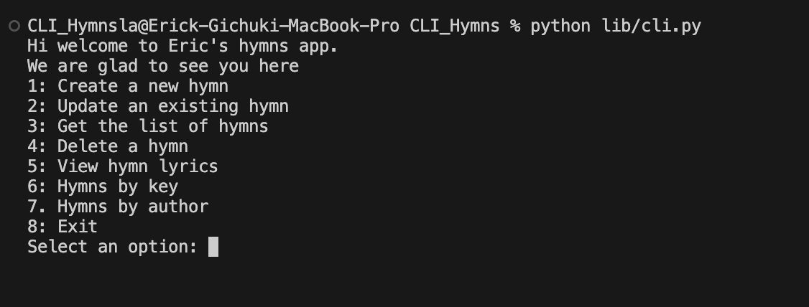
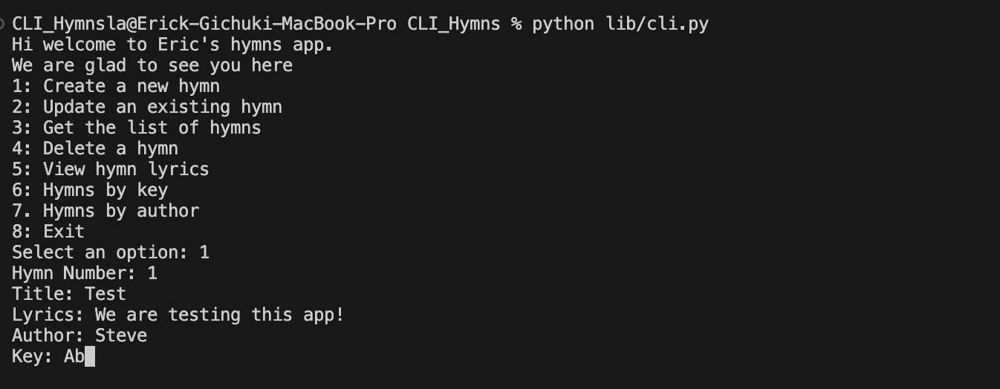
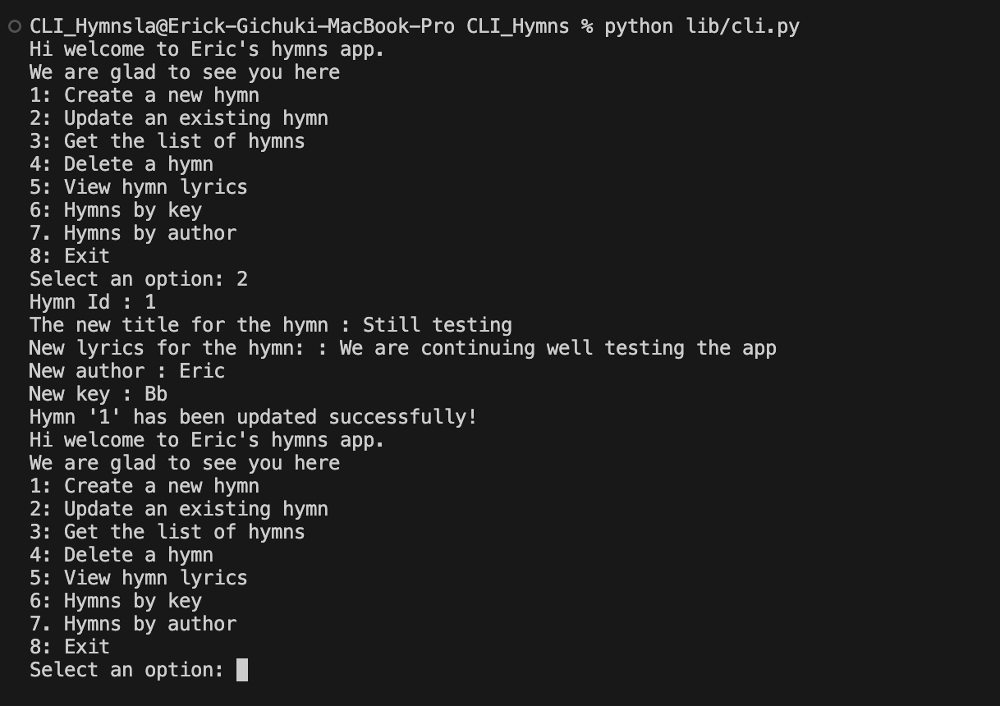
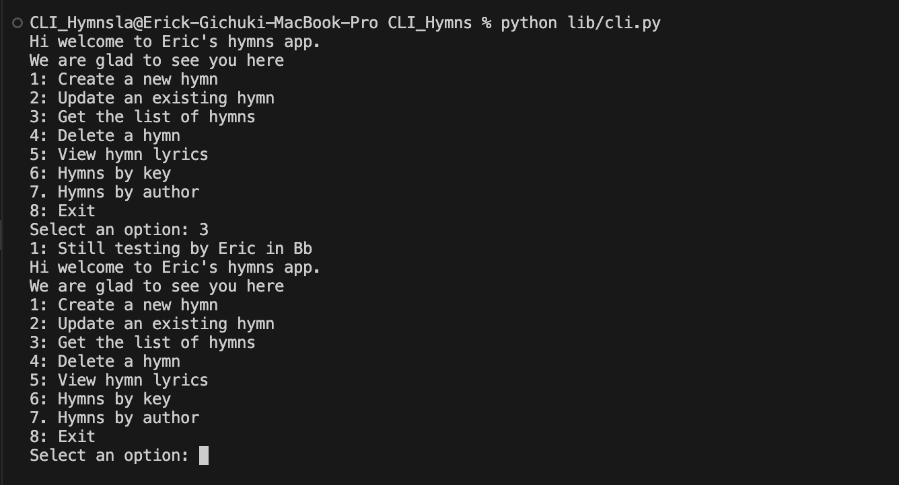
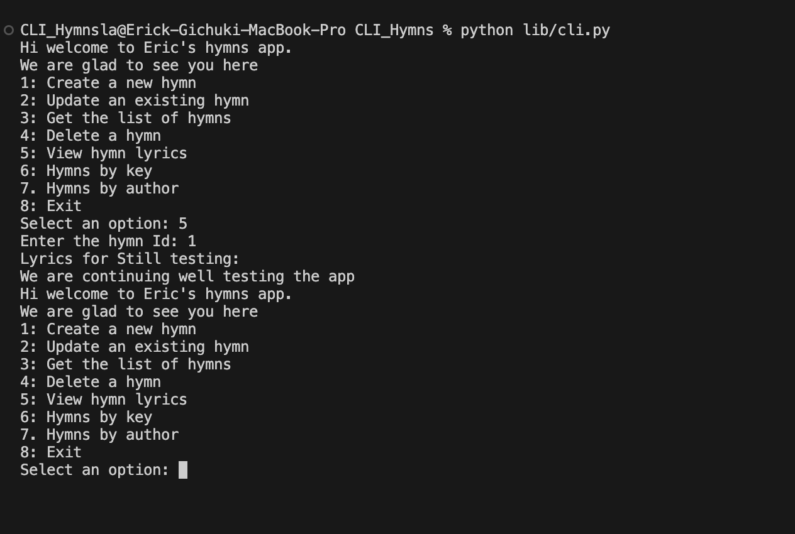
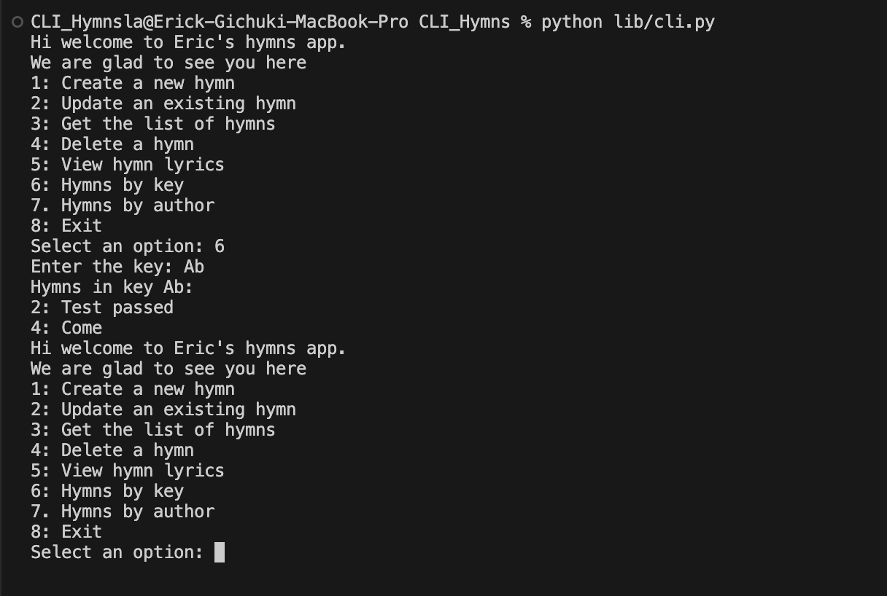
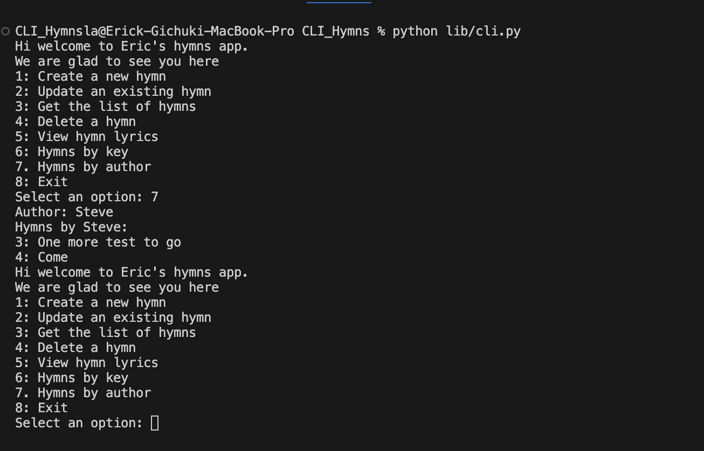
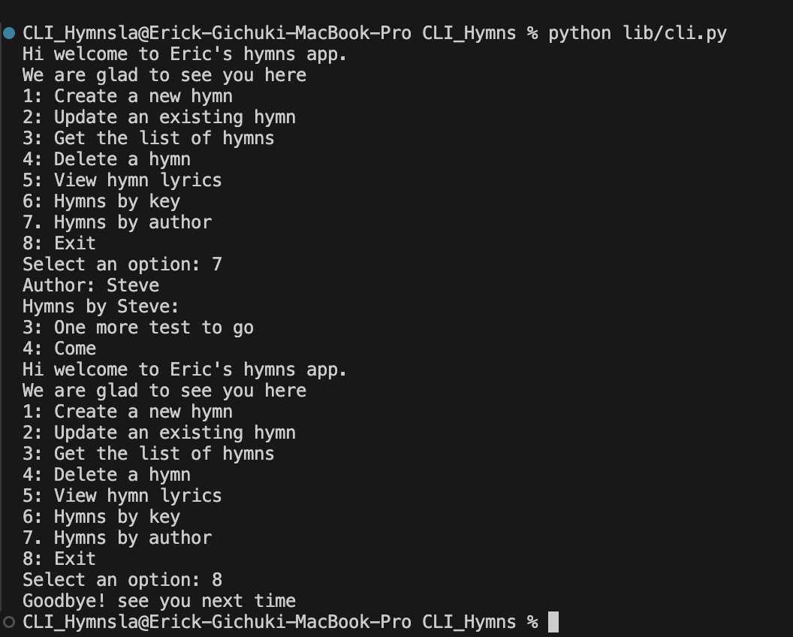

# Hymns CLI App

## Description
#### CLI hymns app has 3 model classes; Hymn, Author and Key.
#### Hymn has a number, title, lyrics, the name of the author and the key.
#### An author can have many hymns which is a one to many relationship.
#### Same to the author a key can have many hymns which is a one to many relationship.
#### Its an app that enables the user to browse hymns seamlessly, add, update, and delete.
#### The app has a good user interface built with click.
#### The user will have to run ```python lib/cli.py``` to start interacting with the app.
#### A welcome message will be displayed and a menu with the options that the app has for user interaction. 
#### These are the 8 options;
- option 1: When the user wants to create a new hymn. The user will be required to enter the number, title, lyrics, author and the key and the user will get a prompt message printed that the hymn has been added successfully. This how it should look like.

- option 2: Updating an existing hymn. It should look this way.

- option 3: Accessing the list of hymns that are in the app.
 
- option 4: Deleting a hymn by Id.

- option 5: Viewing lyrics. When the user wants to view the lyrics of a particular hymn he/she will be required to enter the hymn id.

- option 6: Retrieving hymns that have the same key. Lets say a user wants to get hymns by key since a key can have many hymns he/she simply selects option 6 and this how it will look like.

- option 7: Accessing hymns that are composed by an author. The user is able to get a list of hymns by a certain Author.

- option 8: Exiting. When you are done and wants to leave you should select option 8 and you'll get a goodbye message.

#### When the user enters options that are not in the menu he/she will get an error message.

## Set Up Instructions
#### Fork the repository [https://github.com/ErickGichuki/CLI-hymns-app] to get a copy remotely.
#### Clone the work. Open your terminal and cd to the folder you want to store the work then run git clone SSH Key.
#### Change directory to the cloned folder then run ```code .``` to open the VsCode.
#### Run ```pipenv shell``` to install the dependencies and then ```pipenv shell``` to enter to a virtual environment where you'll be working from.
#### Run ```pip install click``` to have the click library to be used in CLI.
#### For sqlalchemy you have to run ```pip install SQLAlchemy``` .
#### At this point you've got everything to start working.
## Technologies
- Python 3
- SQL
## Bugs
##### So far there are no bugs that have been detected.
##### If you happen to come across any bug kindly don't hesitate reaching out to me [erickgichukimucheru@gmail.com]
## License
Copyright &copy; 2024 All rights reserved.