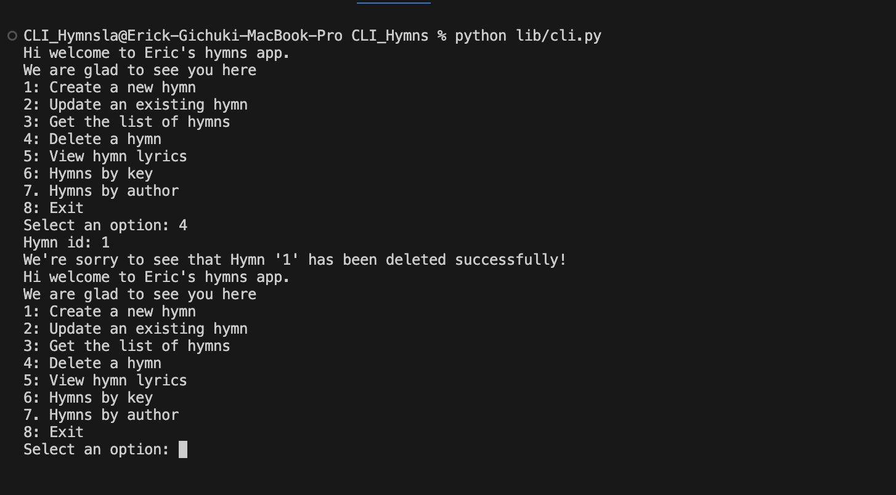

# Hymns CLI App

## Description
#### Welcome to the Hymns CLI App! This application allows users to seamlessly interact with a command-line interface built with Click. The app features three main models classes: Hymn, Author, and Key.
1. Hymn: It has a number, title, lyrics, the name of the author and the key.
2. Author: An author can have many hymns which is a one to many relationship.
3. Key: Each key can have many hymns which also a one to many relationship.
#### To start interacting with the app you'll need to run ```python lib/cli.py```.
#### You'll be greeted with a welcome message and a menu with 8 options 
#### These are the 8 options;
1. Create a new hymn: The user is required to enter the hymn number, title, lyrics, author and key. A confirmation message will be displayed upon successful addition. 
2. Update an existing hymn: The user may need to modify the details of an existing hymn.
3. List all hymns: View a list of hymns in the app. 
4. Delete a hymn: When the user wants to remove a hymn using its Id.
5. View hymn lyrics: When the user wants to view the lyrics of a particular hymn he/she will be required to enter the hymn id.
6. Retrieve hymns by key: The user may need to know which hymns share the same key he/she will select this option and will be required to enter the key.
7. List of hymns by author: view hymns that are composed by an author. The user is able to get a list of hymns by a specific Author.
8. Exit: When the user is done and wants to leave he/she should select option 8 and you'll be able to exit with a goodbye message.
#### If an invalid choice is entered, an error message will be displayed.

## Set Up Instructions
1. Fork the repository: https://github.com/ErickGichuki/CLI-hymns-app to get a copy remotely.
2. Clone the respository: Open your terminal, navigate to the desired folder, and run ```git clone <SSH Key>```.
3. Navigate to the cloned folder: You'll change the directory by running ```cd <cloned folder>```.
4. Open the folder in VSCode: Run```code .``` .
5. Install dependencies:  Run ```pipenv install``` to install the dependencies and then ```pipenv shell``` to enter to a virtual environment where you'll be working from.
6. Install Click Library: Run ```pip install click```.
7. SQLAlchemy: For sqlalchemy you have to run ```pip install SQLAlchemy``` .
- At this point you've got everything to start working.
## Technologies
- Python 3
- SQL
## Bugs
- So far there are no bugs that have been detected.
- If you happen to come across any bug kindly don't hesitate reaching out to me erickgichukimucheru@gmail.com
## License
Copyright &copy; 2024 All rights reserved.